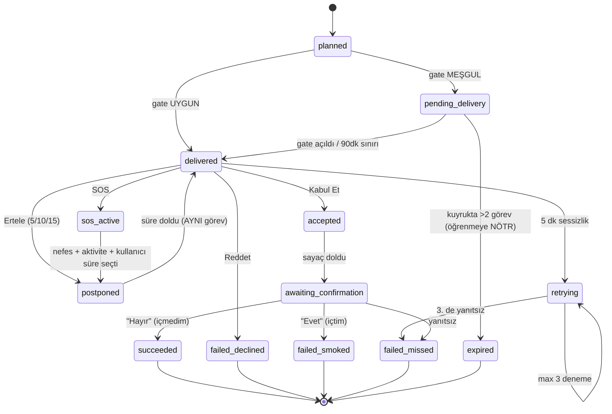

# Görevlendirme Sistemi — Tasarım ve Karar Kaydı

> Durum: **tasarım onaylandı, kod yazılmadı.**
> Bu doküman 2026-07-28 oturumunda alınan kararları kaydeder. Önceki sürüm (6 kademeli
> soyut zorluk merdivenine dayanan) geçersizdir — yerine gerçek sigara aralığına dayalı
> model geçmiştir.

---

## 1. Temel Fikir

Sistem, kullanıcının **gerçekte kaç dakikada bir sigara içtiğini** hesaplar ve bariyer
süresini bunun biraz üstünde tutarak kademeli olarak büyütür. Amaç azaltarak bıraktırmaktır.

```
müsait süre   = 24 saat − uyku − iş saatleri (iş yerinde içilmiyorsa)
doğal aralık  = müsait süre ÷ günlük sigara sayısı
başlangıç     = doğal aralık × 1.25
```

**Örnek kullanıcı:** 07:00 kalkıyor, 23:00 yatıyor, 09:00–17:00 çalışıyor (iş yerinde
içilmiyor), günde 20 sigara.

```
müsait süre   = 24 − 8 (uyku) − 8 (iş) = 8 saat = 480 dakika
doğal aralık  = 480 ÷ 20 = 24 dakika
başlangıç     = 24 × 1.25 = 30 dakika
```

### İlerleme

Her hafta sonunda değerlendirilir:

| Hafta nasıl geçti | Bariyer |
|---|---|
| İyi (hedef tutturuldu **ve** görevler başarılı) | **+%15** |
| Kötü | **−%15** |

**Ölçüt:** gerçek sigara kayıtları **ve** görev başarı oranı birlikte. Kullanıcı "Sigara
İçtim" butonunu kullanmıyorsa görev başarısı tek başına kullanılır.

### Beklenen seyir

| Hafta | Bariyer | Günlük sigara |
|---|---|---|
| 0 | 30 dk | 16 |
| 4 | 52 dk | 9 |
| 12 | 160 dk | 3 |
| 20 | 491 dk | 1 |
| 22 | "bugün hiç içme" | 0 |
| 28 | "3 gün içme" | 0 |
| 34 | "bu ay içme" | 0 |

Bariyer müsait süreyi aşınca formül kendiliğinden günlük, sonra çok günlük taahhütlere
dönüşür. **Eski 6 kademeli tier merdiveni (`resolveDurationTierRange`) silinecektir** —
ilerleme artık bu formülden doğal olarak çıkıyor.

### İlk hafta

Anket verisiyle (beyan edilen sigara sayısı) hemen başlanır. Hafta sonunda gerçek
kayıtlara bakılıp taban yeniden hesaplanır. Beyan eksikse sistem kendini 1 hafta içinde
düzeltir.

---

## 2. Günlük Plan

### Görev sayısı: 4–8

```
base    = round(aktif saat / 2.4)      16 saat ≈ 7
adjust  = +1 (başarı ≥ %75), +1 (≥ %88), −1 (başarısızlık ≥ %45), −1 (erteleme ≥ %50)
jitter  = rastgele {−1, 0, +1}          ← tahmin edilemezlik
sonuç   = clamp(base + adjust + jitter, 4, 8)
```

### Zamanlama

- Riskli saatlere öncelik verilir (`riskyHours`)
- İki görev arası **en az 45 dakika**
- Her gün farklı dakikalar — kullanıcı saati öğrenemez

### Ne zaman görev verilmez

| Zaman | Durum |
|---|---|
| Uyku saatleri | ❌ Görev yok |
| İş saatleri (iş yerinde içilmiyorsa) | ❌ Görev yok |
| **İş molaları** (ankette kayıtlı) | ✅ **Görev var** — gerçek risk anı |
| Diğer uyanık saatler | ✅ Görev var |

### Uzun bariyerlerde kontrol görevleri

Bariyer büyüdükçe 8 saatlik pencereye daha az görev sığar. Günde 4–8 teması korumak için
uzun bariyer sürerken araya kontrol görevleri girer:

```
09:00 ┌ Bariyer başladı (8 saat)
10:47 │ ✓ kontrol: "Devam ediyor musunuz?"
12:30 │ ✓ kontrol
14:55 │ ✓ kontrol
16:10 │ ✓ kontrol
17:00 └ "Bu süre içinde sigara içtiniz mi?"
```

Böylece nüks aynı gün yakalanır ve haftalık değerlendirme bol veri alır.

---

## 3. Görev Akışı

### Bildirim

Tam ekran, koyu, başka uygulamaların üzerinde, alarm sesli, kilit ekranında okunur.

```
┌────────────────────────────────┐
│   42 dakika boyunca            │
│   sigara içmeyiniz.            │
│   Elinizde sigara varsa        │
│   söndürünüz.                  │
│                                │
│   ┌──────────────────────┐     │
│   │      Kabul Et        │     │  yeşil
│   ├──────────────────────┤     │
│   │       Ertele         │     │
│   ├──────────────────────┤     │
│   │       Reddet         │     │
│   ├──────────────────────┤     │
│   │    SOS Krizdeyim     │     │  kırmızı
│   └──────────────────────┘     │
└────────────────────────────────┘
```

### Dört aksiyon

| Aksiyon | Ne olur | Uygulama açılır mı |
|---|---|---|
| **Kabul Et** | Arka planda sayaç başlar | ❌ Hayır |
| **Ertele** | 5 / 10 / 15 dk seçenekleri, sonra aynı görev tekrar | ❌ Hayır |
| **Reddet** | Başarısız + **sigara kaydı +1** | ❌ Hayır |
| **SOS Krizdeyim** | Nefes egzersizi başlar | ✅ **Evet** (tek istisna) |

**Sınırlar:** görev başına en fazla 2 erteleme, 2 SOS.

### Süre bitince — aynı tam ekran

```
┌────────────────────────────────┐
│   Bu süre içinde               │
│   sigara içtiniz mi?           │
│                                │
│   ┌──────────────────────┐     │
│   │        Evet          │     │
│   ├──────────────────────┤     │
│   │        Hayır         │     │
│   └──────────────────────┘     │
└────────────────────────────────┘
```

> ⚠️ **Cevapların anlamı terstir:** **Evet = başarısız** (sigara içildi),
> **Hayır = başarılı**. Mevcut koddaki "Görevi başarıyla tamamladınız mı?" sorusunun tam
> tersi. Yanlış bağlanırsa öğrenme motoru tüm veriyi ters kaydeder.

"Evet" cevabı ayrıca `smoking_events` tablosuna **gerçek sigara kaydı** olarak yazılır.

### Yanıt verilmezse

5 dakika arayla 3 deneme. Üçüncüden sonra da yanıt yoksa görev **başarısız** sayılır. Bu,
uygulama tamamen kapalıyken de çalışır (native watchdog doğrudan veritabanına yazar).

### Oyun / Odak modu / Tam ekran

Görev **kuyruğa alınır, kaybolmaz**. 10 dakikada bir tekrar denenir, en fazla 90 dakika
bekletilir. Kuyrukta 2'den fazla görev birikirse en eskisi teslim edilir, diğerleri
`expired` olarak kapanır ve **öğrenmeye yazılmaz** — kullanıcı sistemin gecikmesi yüzünden
ceza almaz.

---

## 4. SOS Akışı

```
Görevde [SOS Krizdeyim]
        ↓
Uygulama açılır → Nefes egzersizi (4-7-8, döngü halinde)
        ↓  kullanıcı hazır olunca
Aktivite önerisi  ("Bir bardak su iç ve 5 dakika yürü")
        ↓
"Ne zaman devam edelim?"  [30 dk] [1 saat] [2 saat]
        ↓
Görev seçilen süre kadar ertelenir — İPTAL EDİLMEZ
```

Kullanıcı yine de içerse "Sigara İçtim" butonuyla kaydeder.

**Not:** Nefes egzersizi zaten mevcut ve çalışıyor (`craving_sos_page.dart`). Eksik olan
iki şey: "Görev ver" butonunun bağlanmamış olması ve **sayfanın hiç çevrilmemiş olması**
(şu an 24 dilin hepsinde Türkçe görünüyor).

---

## 5. "Sigara İçtim" Butonu

### Yüzen buton

- Şeffaf, `assets/images/no_smoke_splash_icon.png` görseli
- Sürüklenebilir, konumu hatırlanır
- **Ekran her açıldığında görünür** (saat sınırı yok) — ekran kapanınca servis uyur
- Başka uygulamaların üzerinde çalışır

### Yanlış dokunma koruması

```
  basılı tut          %60              tamamlandı
   ○ ─────→      ◔ ─────→        ✓  + titreşim
  (şeffaf)      (halka dolar)    (0.8 sn sonra söner)
```

**3 saniye basılı tutulur.** Erken bırakılırsa halka geri boşalır, kayıt düşmez.

### Kilit ekranı

Yüzen buton kilit ekranının üzerine çizilemez (Android kısıtı). Orada mekanizma **kalıcı
bildirimdeki "Sigara İçtim" aksiyonu**dur. Bildirim butonları 3 saniye basma kabul etmediği
için orada koruma **5 saniyelik "Geri Al"** seçeneğidir.

| Nerede | Mekanizma | Koruma |
|---|---|---|
| Diğer uygulamalar, ana ekran | Şeffaf yüzen buton | 3 sn basılı tut |
| Kilit ekranı | Bildirim aksiyonu | 5 sn "Geri Al" |

### Konum kaydı

**Ham koordinat kaydedilmez.** Kayıt anında `getLastKnownPosition()` çağrılır (anlık, GPS
uyandırmaz), mevcut kayıtlı yerlerden hangisine düştüğüne bakılır, **sadece yer kimliği**
yazılır. Hiçbirine düşmezse boş bırakılır.

Yerler **otomatik etiketlenir** ("en sık gittiğiniz yer", "2. sık gittiğiniz yer") — isim
verme ekranı yapılmayacak.

**Üç kural:**
1. Konum alınamazsa sigara kaydı yine de yazılır (konum asla kaydı engellemez)
2. Konum Zekası kapalıysa hiç denenmez
3. İlk kurulumda açıkça bildirilir

### İlk kurulum tanıtımı

> **Sigara İçtim Butonu**
> Ekranda küçük, şeffaf bir buton belirir. Sigara içtiğinizde **3 saniye basılı tutun** —
> çevresindeki halka dolduğunda tik işareti çıkar ve kayıt alınır. Yanlışlıkla dokunmanız
> durumunda kayıt alınmaz.
> Uygulama böylece hangi **saatlerde** ve hangi **yerlerde** sigara içme eğiliminiz
> olduğunu öğrenir, görevleri tam o riskli anlara denk getirir.
> Konum bilgisi yalnızca daha önce tanımlanmış sık gittiğiniz yerlerle eşleştirilir; adres
> veya hareket geçmişiniz saklanmaz. Tüm kayıtlar yalnızca cihazınızda tutulur.
> İstediğiniz zaman Ayarlar'dan kapatabilirsiniz.

### Veri nereye gider

```
"Sigara İçtim" kaydı
      ├──→ riskyHours hesabı   → ertesi günün görev saatlerini belirler  [YENİ BAĞLANTI]
      ├──→ haftalık değerlendirme → bariyer büyür/küçülür
      ├──→ SmokingTimePredictionEngine kalibrasyonu                      [YENİ]
      └──→ raporlar
```

> Şu an sigara kayıtları `riskyHours` hesabına **girmiyor** — risk saatleri yalnızca anket
> zamanları, telefon kullanımı ve görev başarısızlıklarından üretiliyor
> (`storage_service.dart:2832`). Bu bağlantı kurulacak ve döngü kapanacak.

---

## 6. İlaç Sistemi

| Konu | Karar |
|---|---|
| Birden fazla ilaç | ✅ Zaten çalışıyor, dokunulmayacak |
| Günde kaç kez | **Sorulacak**, sonra uyanık saatlere eşit dağıtılmış saatler otomatik önerilecek, kullanıcı düzeltebilecek |
| Hastalığa özel tavsiye | **Her ilaç hatırlatmasının içine gömülecek** — ayrı bildirim gönderilmeyecek |
| İpucu havuzu | 10 → **150** (5 hastalık × 30 ipucu) |
| İlaç kullanmayan, hastalığı olan kullanıcı | Günde **1 tavsiye bildirimi** |
| Tıbbi kapsam | Genel yaşam tarzı düzeyinde. Doz/tedavi önerisi **yok**. Her ipucunun altında "doktorunuza danışın" |

**Kaldırılacak:** mevcut `scheduleHealthConditionAdviceNotifications` (günde 3 ayrı tavsiye
bildirimi).

**Kapsanan hastalıklar:** Hipertansiyon, Astım, Diyabet, KOAH, Kalp Hastalığı (ankette
sunulan beşin tamamı).

> ⚠️ 150 sağlık cümlesi yazılacak. Yayına almadan önce **tıbbi içeriğin gözden geçirilmesi
> önerilir.**

---

## 7. Mimari

### Katmanlar

```
lib/
├── models/
│   ├── task_assignment.dart          [YENİ]  Görev + durum makinesi
│   └── adaptive_task_models.dart     [KORUNUR] Öğrenme sözleşmesi değişmiyor
│
├── services/
│   ├── smoking_interval_service.dart [YENİ]  Doğal aralık + haftalık değerlendirme
│   ├── task_assignment_service.dart  [YENİ]  Tek karar merkezi
│   ├── task_delivery_gate.dart       [YENİ]  Oyun/DND/tam ekran kararı
│   ├── task_scheduler_service.dart   [YENİ]  Platforma göre zamanlama
│   ├── smoked_log_service.dart       [YENİ]  Sigara kaydı + konum eşleme
│   ├── discipline_protocol_service.dart [DEĞİŞİR] tier merdiveni silinir
│   ├── notification_service.dart     [DEĞİŞİR] 4 aksiyon, arka plan işleme
│   └── storage_service.dart          [DEĞİŞİR] task_assignments tablosu, placeId sütunu
│
└── pages/
    ├── craving_sos_page.dart         [DEĞİŞİR] aktivite önerisi + erteleme + çeviri
    ├── medications_page.dart         [DEĞİŞİR] "günde kaç kez" akışı
    └── smoked_log_consent_page.dart  [YENİ]  ilk kurulum tanıtımı
```

**Katman kuralı:** `smoking_interval_service` ve `discipline_protocol_service` saf kalır
(I/O yok, test edilebilir). Yan etkiler `task_assignment_service`'te toplanır. Bildirim
katmanı karar vermez, sadece gösterir.

### Görev durum makinesi



### Terminal durum → öğrenme sonucu

| Durum | Sonuç | Sigara kaydı |
|---|---|---|
| `succeeded` | `success` | — |
| `failed_declined` (Reddet) | `smoked` | **+1** |
| `failed_smoked` ("Evet") | `smoked` | **+1** |
| `failed_missed` | `missed` | — |
| `expired` | *(yazılmaz)* | — |

### Pil stratejisi

- Sayaç için **foreground service değil**, tek bir `setExactAndAllowWhileIdle` alarmı.
  30 dakikalık da 30 günlük de olsa arada sıfır CPU harcanır.
- Foreground service yalnızca yanıt beklenen 15 dakikalık pencerede yaşar.
- Yüzen buton servisi **ekran kapanınca uyur** (`ACTION_SCREEN_OFF`).
- Günlük alarm bütçesi: ≤ 8 tetikleyici + ≤ 8 sayaç + ertelemeler ≈ 20 alarm.

### iOS

Bu partide **kod yazılmayacak**, sadece üç noktada arayüz sınırı çizilecek: teslim,
zamanlama, meşguliyet tespiti. İş mantığının tamamı zaten platform-bağımsız saf Dart.

**Kabul edilen kısıt:** iOS'ta overlay API'si yok — "başka uygulamaların üzerinde tam ekran
görev" iOS'ta **imkânsız**. iOS sürümü kaçınılmaz olarak daha yumuşak olacaktır.

---

## 8. Bilinen Riskler

| Risk | Önlem |
|---|---|
| Android 14+ `USE_FULL_SCREEN_INTENT` kısıtı | Katmanlı düşüş: tam ekran → overlay → ısrarlı heads-up. Görev asla kaybolmaz. |
| OEM pil yönetimi (MIUI, EMUI, ColorOS…) alarmları öldürüyor | Pil optimizasyonu muafiyeti + boot receiver + her açılışta alarm mutabakatı |
| Yüzen buton = geniş `SYSTEM_ALERT_WINDOW` kullanımı, Play Store riski | Gerekçe dokümanı güncellenecek; buton yalnızca ekran açıkken, kullanıcı onayıyla |
| Oyun tespiti sezgiseldir | Yanlış pozitifin bedeli sadece gecikme (max 90 dk). `AccessibilityService` **kullanılmayacak** (Play yasağı) |
| Arka plan isolate ↔ SQLite yarışı | Arka plan doğrudan DB'ye yazmaz; SharedPreferences kuyruğu, ana isolate boşaltır (projede kanıtlanmış desen) |
| Bildirim kanalı değişmezliği | Değişen kanalların ID sürümü artırılır, eskiler silinir |
| Tahmin motoru kalibrasyonu doğrulanamıyor | Sentetik veriyle birim testleri yazılacak |

---

## 9. Karar Kaydı (2026-07-28)

| # | Konu | Karar |
|---|---|---|
| 1 | Yer isimlendirme | Otomatik etiket, isim verme ekranı yok |
| 2 | Başlangıç bariyeri | Doğal aralık × 1.25 |
| 3 | Artış hızı | Haftalık +%15 |
| 4 | Kötü hafta | −%15 geri çekilme |
| 5 | Değerlendirme ölçütü | Gerçek sigara sayısı + görev başarısı |
| 6 | Bitiş noktası | Formül doğal olarak devam eder, tier merdiveni silinir |
| 7 | Görev sayısı | Kontrol görevleriyle 4–8'de kalır |
| 8 | Reddet cezası | Tam ceza — sigara içildi sayılır |
| 9 | İş saatleri | Sadece molalarda görev |
| 10 | İlk hafta | Anket verisiyle başla, hafta sonu düzelt |
| 11 | Yüzen buton | Ekran her açıldığında |
| 12 | Yanlış dokunma | 3 sn basılı tut + halka + tik |
| 13 | SOS akışı | Nefes → aktivite önerisi → kullanıcı erteleme süresi seçer |
| 14 | İlaç saatleri | "Günde kaç kez" sorulur, saatler otomatik önerilir |
| 15 | Tavsiye dağıtımı | Her ilaç hatırlatmasına gömülü |
| 16 | İpucu havuzu | 150 (5 × 30) |
| 17 | İlaçsız kullanıcı | Günde 1 tavsiye bildirimi |
| 18 | Tahmin motoru | Kalibrasyon bu partide yazılacak |
| 19 | iOS | Sınır şimdi çizilir, kod sonra |
